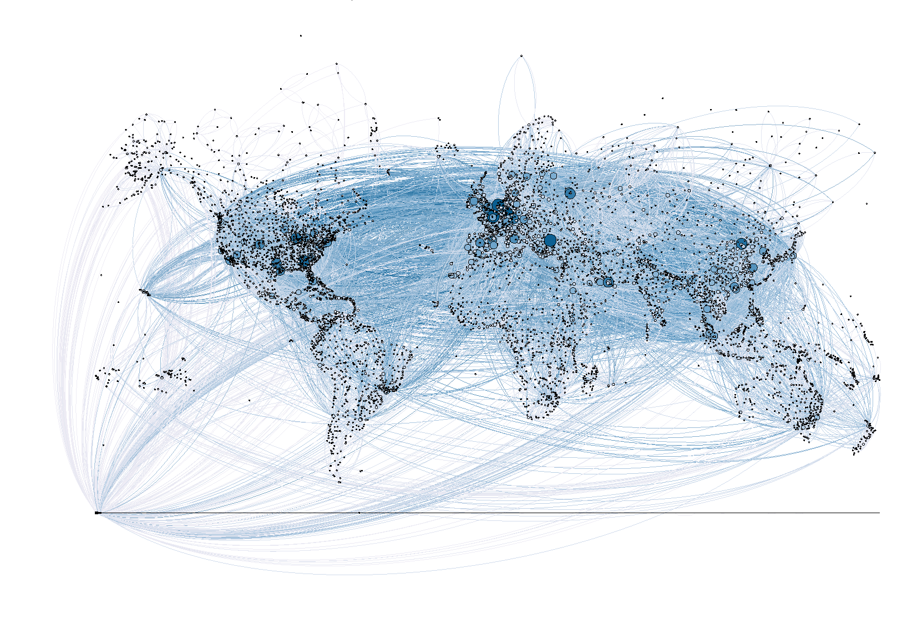
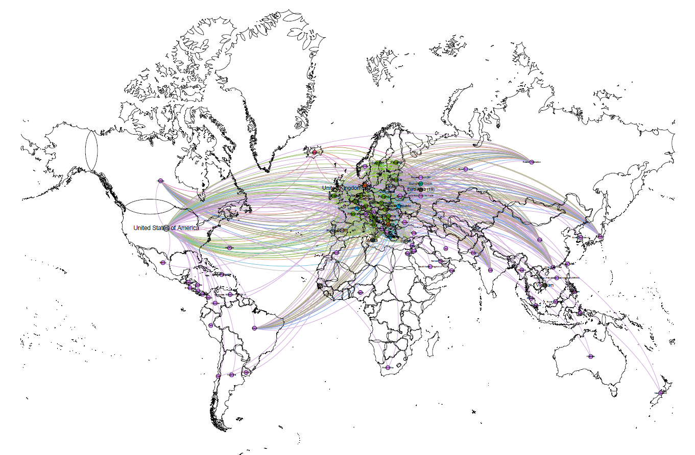

# Visualizing-and-analyze-Data-with-Gephi
3 sets of network visualization with the software Gephi and the help of Python in the data transformation process.

## Introduction
I have conducted 3 sets of network visualization with the software Gephi and the help of Python in the data transformation process.

This readme file will briefly introduce each of the network visualizations, how the data is obtained and presented, how people can make use of the resulting graph and some major findings by viewing the output graph.

## Output
The 3 sets of network visualization conducted are:
1. Major flight routes around the world in 2014

2. President Donald Trump’s Twitter social network

3. Trade volume with European countries around the world

## Reference
https://youngjoon5.github.io/tips.html
